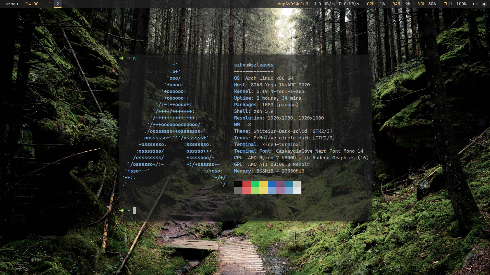
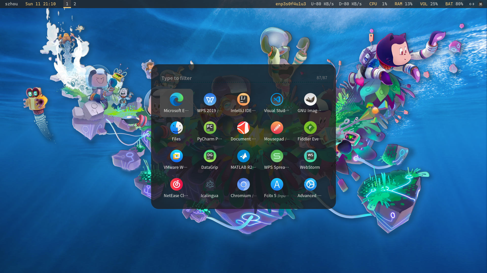

# beauty-dark-i3
A **dark** theme about i3wm, include dunst, picom, polybar and rofi.  




## Dependency
* i3wm (or i3-gaps)
* qt5ct, qt5-styleplugins (unified appearance between gtk and qt)
* lxappearance-gtk3 (themes manager)
* nm-applet ([NetworkManager](https://wiki.archlinux.org/index.php/NetworkManager))
* xfce4-power-manager (used to adjust backlight)
* dunst (used to system notice)
* picom (use [jonaburg fork ](https://github.com/jonaburg/picom) **to enable blur-style and radius-style** which default disable)
* polybar
* rofi
* xfce4-terminal
* feh (used to set background image)
* redshift (used to set color temperature)
* pulseaudio (pavucontrol)
* blueman (blueman-manager)
* gnome-keyring (password keyring manager, some applications to use it)

## Other Applications
* Gnome clocks (clock and timer)
* Gnome todo   (schedule)
* Gnome screenshot (screenshot)

## Location
`$HOME/.config/i3`  

## Unified Appearance (Qt and GTK)
**set environment variable in `/etc/profile`**  
`export QT_QPA_PLATFORMTHEME=qt5ct`  
and run this command `qt5ct` in terminal  

If you want the qt4/qt5 appearance the same as gtk theme, set style as `gtk2`.   
You can also change the fonts setting.
> more detail: [Uniform look for Qt and GTK applications](https://wiki.archlinux.org/index.php/Uniform_look_for_Qt_and_GTK_applications)

## Key Setting
It is basically the same as i3wm normal configure.  
There are some new functional keys in this i3wmconfig:  
* `mod + c`          open clock application
* `mod + T`          color temperature adjust  
* `mod + F1`         open the pulseaudio to control volume
* `mod + F4`         open the bluetooth manager
* `mod + Shift + T`  cancel color temperature adjust  
* `mod + Shift + S`  open screenshot application
* `mod + o`          run `dunstctl` to close notification windows
* `mod + Shift + o`  run `dunstctl` to display history notification windows

## Polybar display in multiple screens 
Please run `xrandr -q | grep " connected" | cut -d ' ' -f1` command to confirm your display device ports.  
For example, If you had two monitors and they connected `eDP` ports and `HDMI-A-0` ports,   
you can modify `polybar/config.ini` like this:
```bash
[monitor]
;; specify your connected port to here (as a variable) and make sure they had connected.
main = eDP
external = HDMI-A-0
```
and use them:
```bash
;; the first monitor
[bar/main]
monitor = ${monitor.main}

...

;; the second monitor
[bar/external]
monitor = ${monitor.external}
```
> In my config file, two screens' polybar style configure are the same.

## Thanks :)
* [da-edra/dotfiles](https://github.com/da-edra/dotfiles)
* [aeghn/prettyi3](https://github.com/aeghn/prettyi3)
* [jorhelp/Config_for_Linux](https://github.com/jorhelp/Config_for_Linux)
* [i3 wiki](https://wiki.archlinux.org/index.php/I3)
* [polybar wiki](https://github.com/polybar/polybar/wiki)
* [picom wiki](https://wiki.archlinux.org/index.php/Picom)
* [rofi transparency](https://blog.sarine.nl/2017/04/10/rofi-140-sneak-preview7.html)
